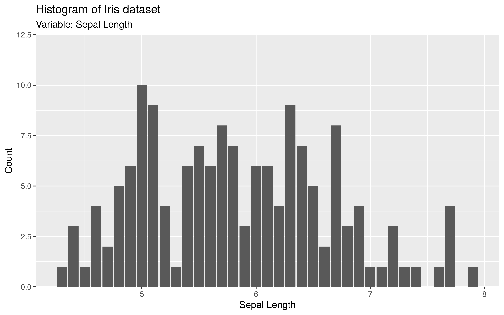

# neo_down

## Description

**neo_down:** Attach plot area to bottom (down). This function is useful
to attach your plot data to the bottom (x line).

## Usage

```r
neo_down(add = 0.25)
```

## Arguments

`add`: float value of additive range expansion constants. The default
value is 0.25. Recommended parameter value: 0.25 or 0.5.

## Value

A ggplot scale_y_continuous object

## Examples

```r
library(ggplot2)
library(nelsonthemes)

ggplot(iris, aes(x = Sepal.Length)) +
geom_bar(stat = "count") +
  labs(
    title = "Histogram of Iris dataset",
    subtitle = "Variable: Sepal Length",
    x = "Sepal Length",
    y = "Count"
  ) +
  neo_down()
```


