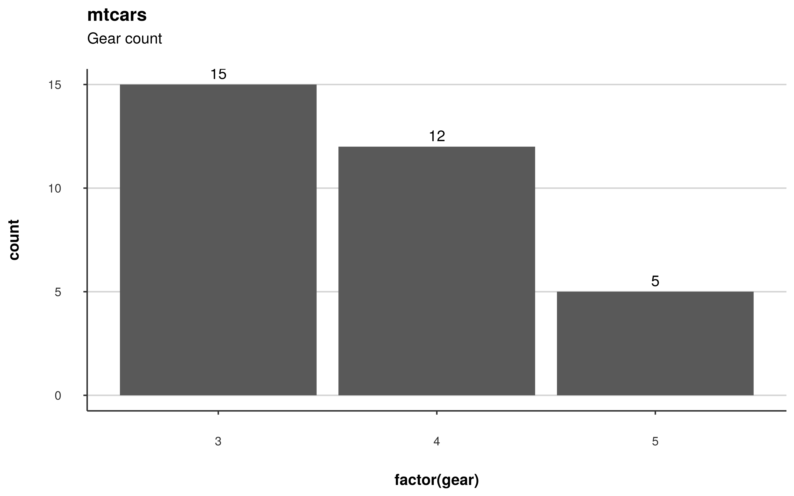

# theme_neo

## Description

**theme_neo:** A extensible simple but pretty production-ready ggplot
theme. A simple but pretty ggplot theme.

## Usage

```r
theme_neo(layout = 2)
```

## Arguments

`layout` x lines design integer. It can be 4 to display both major and
minor grids from x and y, 3 to display both major and minor x lines, 2
to display only major line, 1 to display only minor line and 0 to
display none.

## Value

A ggplot theme object

## Examples

```r
require(ggplot2)
ggplot(mtcars, aes(x=  factor(gear))) +
geom_bar() +
  scale_y_continuous(
    expand = expansion(c(0, 0.5))
  ) +
  geom_text(
    stat="count",
    aes(label = after_stat(count)),
    vjust = -0.5
  ) +
  labs(
    title = "mtcars",
    subtitle = "Gear count"
  ) +
  theme_neo()
```


