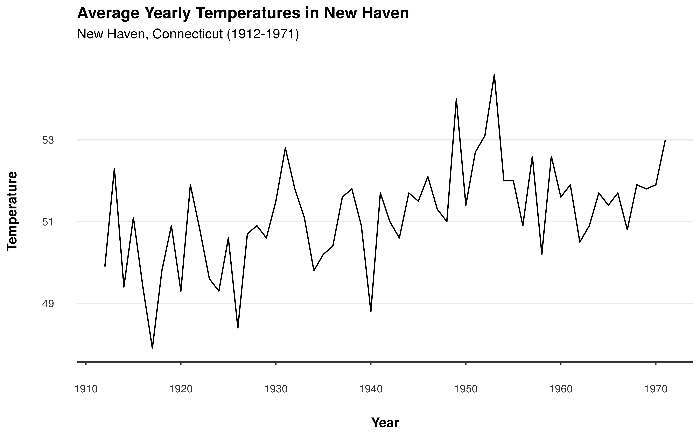

# theme_neo_x

## Description

**theme_neo_x:** A simple but pretty production ready ggplot theme
(x-axis). A recommended for time series simple but pretty production
ready ggplot theme.

## Usage

```r
theme_neo_x()
```

## Value

A ggplot theme object

## Examples

```r
library(nelsonthemes)
library(ggplot2)

# Converting nhtemp time series object to data frame
nhtemp <- data.frame(nhtemp = nhtemp, year = 1912:1971)

# Time Series/Line chart
ggplot(nhtemp, aes(y = nhtemp, x = year)) +
  geom_line() +
  theme_neo_x() +
  labs(
    title = "Average Yearly Temperatures in New Haven",
    subtitle = "New Haven, Connecticut (1912-1971)",
    x = "Year",
    y = "Temperature"
  )
```


